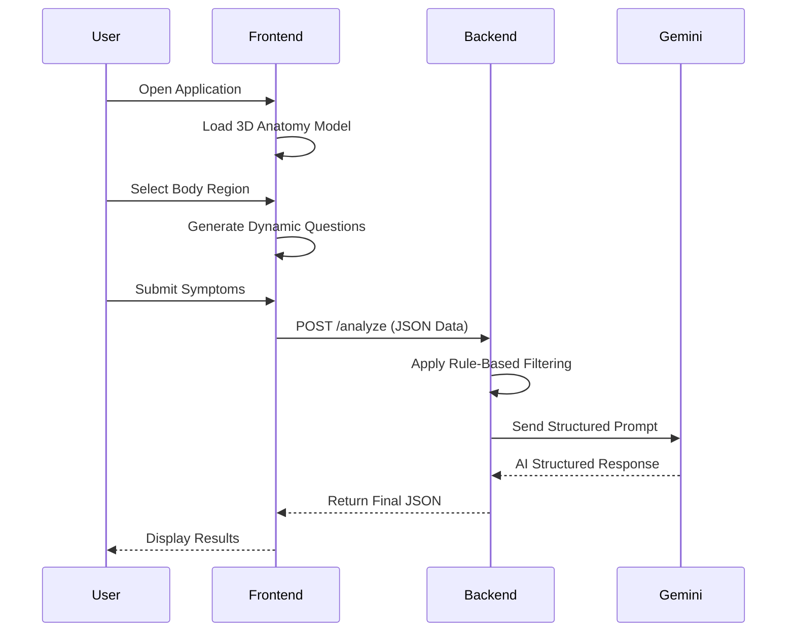

# 🧠 AI-Powered 3D Symptom Guidance Web Application

An AI-powered web-based symptom guidance system that allows users to interact with a **3D human anatomy model**, pinpoint pain locations, answer structured symptom questions, and receive AI-generated guidance including:

* **Ranked possible causes**
* **Home remedies**
* **OTC (non-prescription) guidance**
* **Red-flag warnings**

> ⚠️ **Disclaimer:** This tool provides informational guidance only and does NOT replace professional medical advice.

---

# 📌 Project Overview

This project combines:

* **3D Human Anatomy Visualization**
* **Interactive Pain Mapping**
* **Rule-Based Filtering Engine**
* **Structured AI Prompt Engineering**
* **Gemini API Integration**
* **Modern Full-Stack Architecture**

The goal is to simulate a smart symptom checker while maintaining medical safety constraints.

---

# 🎯 Objectives

* Provide structured symptom guidance.
* Allow intuitive pain selection via 3D model.
* Integrate AI safely using guardrails.
* Demonstrate full-stack + AI integration.
* Build a portfolio-level academic project.

---

# 🏗️ Tech Stack

## 🔹 Frontend

* **React (Vite)**
* **Three.js**
* **@react-three/fiber**
* **@react-three/drei**
* **Tailwind CSS**
* **ShadCN UI**

## 🔹 Backend

* **Python 3.10+**
* **FastAPI**
* **Pydantic**
* **Uvicorn**
* **Gemini API**

## 🔹 Data Layer

* JSON-based pain mapping
* Rule-based filtering system
* Structured prompt templates

---

# 🧩 System Architecture

```
User
  ↓
React Frontend (3D Model + Form)
  ↓
FastAPI Backend
  ↓
Rule-Based Filtering
  ↓
Gemini API
  ↓
Structured Response
  ↓
Frontend Result Rendering
```

---

# 📂 Project Structure

## 📁 Frontend

```
frontend/
│
├── public/
│   └── models/
│       └── human_anatomy.glb
├── src/
│   ├── components/
│   │   ├── AnatomyModel.jsx
│   │   ├── QuestionForm.jsx
│   │   ├── ResultCard.jsx
│   │
│   ├── pages/
│   │   ├── Home.jsx
│   │   ├── Results.jsx
│   │
│   ├── utils/
│   │   ├── api.js
│   │
│   ├── App.jsx
│   └── main.jsx
```

---

## 📁 Backend

```
backend/
│
├── app/
│   ├── main.py
│   ├── pain_map.py
│   ├── ai_service.py
│   ├── models.py
│
├── requirements.txt
└── .env
```

---

# 🧠 Core Features

## 1️⃣ 3D Human Anatomy Model

* Interactive `.glb` model
* Clickable body regions
* Front/Back toggle
* Orbit controls
* Smooth rotation and zoom

**Model Sources:**

* Sketchfab (Free + CC License)
* CGTrader (Free section)
* TurboSquid (Free models)

---

## 2️⃣ Body Region Mapping

Each mesh maps to an internal region ID:

```python
"lower_back_left"
"neck"
"right_knee"
```

This triggers dynamic symptom questions.

---

## 3️⃣ Pain Mapping Logic (Rule-Based Layer)

Example:

```python
pain_map = {
    "lower_back_left": {
        "conditions": [
            "Muscle strain",
            "Sciatica",
            "Kidney infection"
        ],
        "questions": [
            "Does pain radiate to leg?",
            "Do you have fever?",
            "Did you lift heavy objects recently?"
        ],
        "red_flags": [
            "Loss of bladder control",
            "Severe leg weakness"
        ]
    }
}
```

---

## 4️⃣ AI Integration (Gemini)

Structured prompt includes:

* Pain location
* Pain type
* Duration
* Additional symptoms
* Rule-based hints

AI returns:

* Ranked possible causes
* Urgency level (Low / Medium / High)
* OTC guidance (non-prescription only)
* Home remedies
* Red flag escalation advice

---

# 🔒 Safety Guardrails

* ❌ No prescription medicines
* ❌ No medical diagnosis claims
* ✅ Emergency escalation logic
* ✅ Structured AI prompts
* ✅ Mandatory disclaimer
* ✅ Backend validation

---

# 🔄 Application Flow

### Step 1 – User Opens App

* 3D anatomy model loads

### Step 2 – User Selects Body Region

* Mesh click detected
* Region ID identified

### Step 3 – Dynamic Form Generation

* Questions pulled from pain_map

### Step 4 – Form Submission

* JSON sent to backend

### Step 5 – Backend Processing

* Rule-based filtering
* Structured Gemini prompt generation
* AI response parsing

### Step 6 – Result Display

* Ranked causes
* Urgency indicator
* Remedies + OTC guidance
* Red flag warnings

---

# 📡 API Design

## POST `/analyze`

### Request Example

```json
{
  "location": "lower_back_left",
  "pain_type": "sharp",
  "duration_days": 14,
  "symptoms": {
    "radiating": true,
    "fever": false,
    "injury_history": true
  }
}
```

### Response Example

```json
{
  "possible_causes": [],
  "urgency": "Medium",
  "home_remedies": [],
  "otc_guidance": [],
  "red_flags": []
}
```

---

# 🧪 MVP Scope

Initial Supported Regions:

* Lower Back
* Neck
* Knee
* Shoulder
* Abdomen

Limit:

* 3–4 conditions per region
* Basic rule engine
* Clean structured AI output

---

# ⚙️ Installation Guide

## Backend Setup

```bash
cd backend
python -m venv venv
source venv/bin/activate  # Mac/Linux
venv\Scripts\activate     # Windows
pip install -r requirements.txt
uvicorn app.main:app --reload
```

---

## Frontend Setup

```bash
cd frontend
npm install
npm run dev
```

---

# 🏊 Swimlane Diagram (GitHub Mermaid Supported)




---

# 🎓 Academic Value

This project demonstrates:

* Full-stack system architecture
* 3D rendering in web applications
* AI integration using structured prompts
* Backend validation and safety guardrails
* Healthcare system modeling
* Modular and scalable design

---

# 🚀 Future Enhancements

* Multi-language support (Urdu + English)
* Database integration (user history)
* Severity scoring algorithm
* Authentication system
* Telemedicine integration
* Nearby clinic locator

---

# ⚠️ Final Disclaimer

This application is for educational and informational purposes only. It does not provide medical diagnosis or replace consultation with licensed healthcare professionals.

